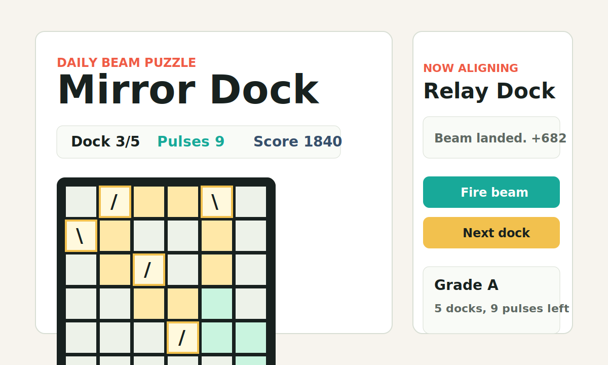

# Mirror Dock

Mirror Dock is a no-dependency daily browser puzzle. Rotate a handful of slash/backslash mirrors, fire the beam, and try to dock five generated boards before your pulse bank runs out.



## What it can do

- Generates five deterministic daily 6x6 beam puzzles from the Asia/Shanghai date.
- Lets players rotate mirrors, fire the beam, see the path, and advance dock by dock.
- Tracks pulse bank, shots, score, grade, daily best score, and a copyable share result.
- Works as a static site with no login, API key, build step, framework, or asset download.
- Includes a browser smoke test that completes the daily run on desktop and `390x844` mobile.

## Why it is fun

The board is tiny, but each click has immediate consequences. A wrong mirror spills the beam or traps it in a loop; a correct route lights up the dock and moves you to the next board. It is short enough to play in one tab break and deterministic enough for people to compare the same daily route.

## Why it may be worth starring

- It is easy to understand from the screenshot and playable within seconds.
- The daily seed, score, grade, and share text make it naturally replayable and link-friendly.
- The implementation is compact, readable, and dependency-free, so it is useful as a reference for polished static browser toys.
- The project ships with validation scripts, mobile checks, README positioning, license, topics-ready metadata, and GitHub Pages support.

## Core loop

1. Start the run.
2. Rotate mirrors on the 6x6 dock board.
3. Fire the beam and read the path feedback.
4. Land five docks for the best grade, or recover before pulses hit zero.
5. Copy the result and compare the daily route.

## Run locally

```bash
npm run serve
```

Then open:

```text
http://localhost:5222
```

For a fixed daily route while testing:

```text
http://localhost:5222/index.html?date=2026-06-02
```

## Validation

```bash
npm run check
npm run verify:browser
```

`npm run check` validates the generated puzzle set, scoring, share text, required files, README sections, and mobile CSS hook.

`npm run verify:browser` launches a local Chrome/CDP smoke test, loads the page, interacts with the board, solves all five docks through the public smoke hook, verifies the final result panel, and checks that a `390x844` viewport has no horizontal overflow.

## Inspiration sources

This project only borrows the broad product shape of short, playful browser-native experiences:

- [Hacker News Show HN](https://news.ycombinator.com/show), where recent posts included tiny games and browser-native visual experiments.
- [GitHub Trending JavaScript](https://github.com/trending/javascript?since=daily), used as a pulse check for small web projects people are actively exploring.
- [Product Hunt Games](https://www.producthunt.com/topics/games), used as a reminder that instantly legible, low-friction fun tends to be more shareable.

No external code, copy, design file, or copyrighted asset was reused.

## Future ideas

- Add a weekly leaderboard file format for self-hosted groups.
- Add optional hard mode with hidden decoy mirrors.
- Export the daily board as an image for easier sharing.
- Add a puzzle editor that emits a URL-safe seed.

## License

MIT
